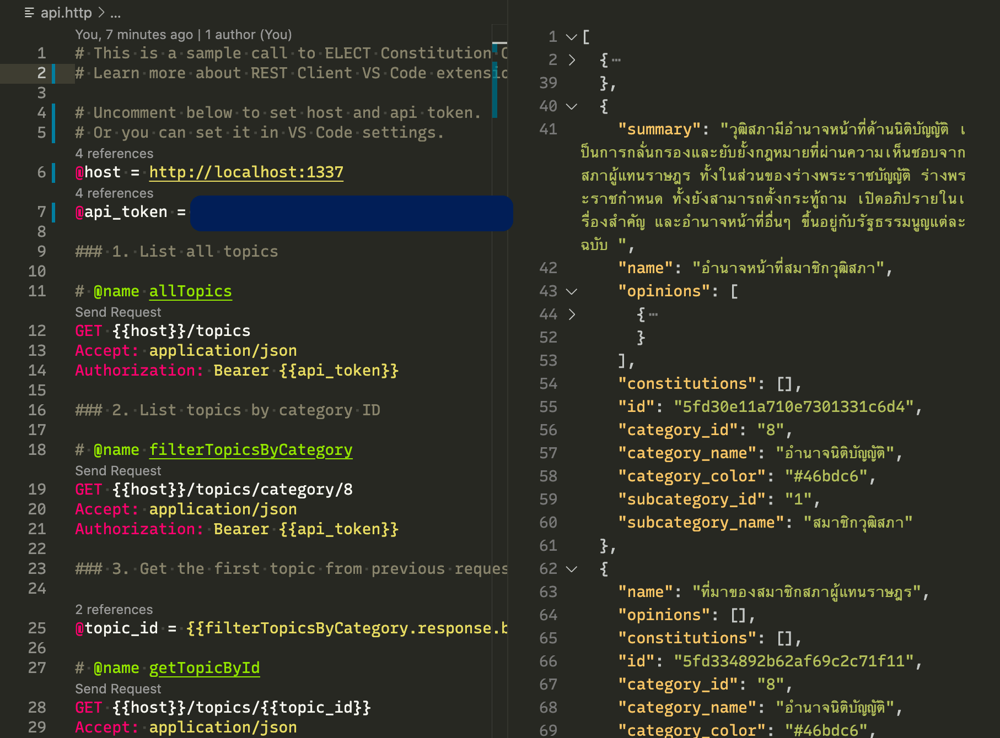

# ELECT Constitution CMS & API

A quick description of your strapi application

## Documentation

We're using [REST Client](https://github.com/Huachao/vscode-restclient) to test API request.
**REST Client** is a VSCode extension to conveniently send and test REST request within the editor.

After install the extension, open `api.http` file and press "Send Request" on top of each pre-defeined requests. You need to set `@host` and `@api_token` in order to authenticate the request with Strapi. See **Endpoints** below for possible `@host`. `@api_token` is from **Strapi admin > Documentation > JWT Token**.



### Endpoints

- Staging: https://cms.constitution.kickdown.dev
- Production: TBA

### API

| Task | API |
| -- | -- |
| 1. List all topics | `GET /topics` |
| 2. List topics by category ID | `GET /topics/category/:category_id` |
| 3. Get single topic by ID | `GET /topics` |

## Deployment

On project directory, build once for production

```bash
npm i
NODE_ENV=production npm run build
```

Then, prepare PM2 config file:

```bash
nano ecosystem.config.yml
```

```yaml
---
apps:
  - name: constitution-strapi
    script: node_modules/.bin/strapi
    args:
      - start
    min_uptime: 10000
    max_restarts: 3
    env:
      NODE_ENV: production
      HOST: 127.0.0.1
      PORT: 8080
      DATABASE_PATH: /path/to/constitution-strapi/.tmp/data.sqlite3.db
```

Type this command to manage and auto restart server.

```
# Start this server managed by PM2
pm2 start ecosystem.config.yml

# Register to start on sysyem reboot
pm2 startup systemd

# Look up the printed results, copy/paste to run command in "Command list"
#   Command list
#   [ 'systemctl enable pm2-your-name' ]
#   $ systemctl enable pm2-your-name

# Save PM2 process list and environment
pm2 save
```

When new update is available, you can pull new code, build and restart using PM2.

```bash
git pull
npm i
NODE_ENV=production npm build
pm2 restart constitution-strapi
```
